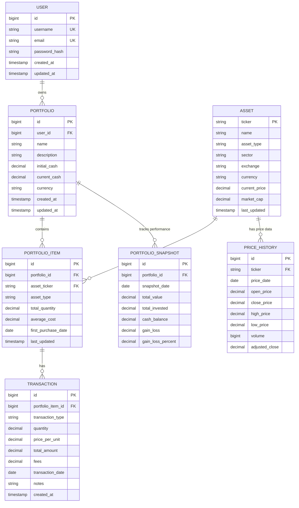
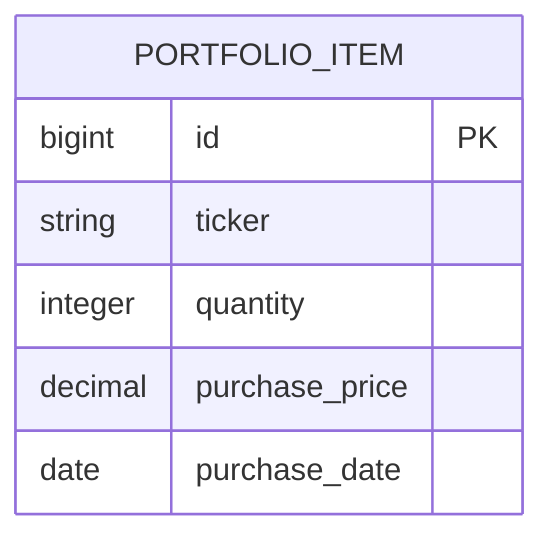
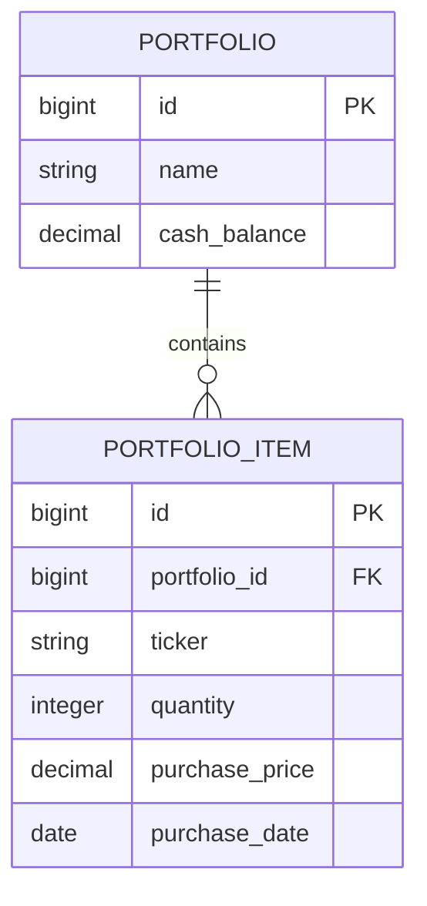
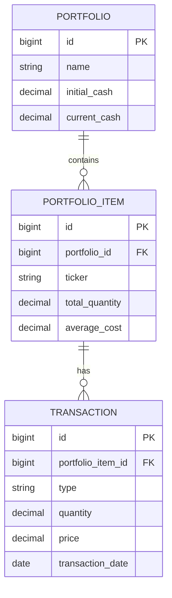
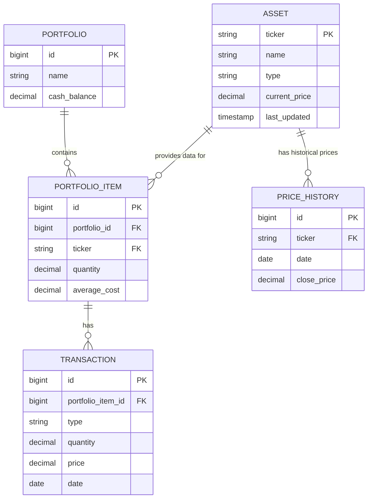

# Portfolio Manager - Entity Relationship Diagram

## Conceptual ER Diagram



---

## Phase 1: Minimal Viable Product (MVP)

**Start with this simple structure:**



**Expand to:**



---

## Phase 2: Add Transaction History



---

## Phase 3: External Asset Data Integration



---

## Database Relationships Explained

### One-to-Many Relationships

1. **PORTFOLIO → PORTFOLIO_ITEM**
   - One portfolio can have multiple items (stocks, bonds, etc.)
   - Each portfolio item belongs to one portfolio

2. **PORTFOLIO_ITEM → TRANSACTION**
   - One portfolio item can have multiple transactions (buy, sell)
   - Each transaction relates to one portfolio item

3. **ASSET → PORTFOLIO_ITEM**
   - One asset (e.g., AAPL) can be in multiple portfolios
   - Each portfolio item references one asset

4. **ASSET → PRICE_HISTORY**
   - One asset has many historical price records
   - Each price record belongs to one asset

### Optional Relationships (Future Enhancements)

5. **USER → PORTFOLIO** (for multi-user support)
6. **PORTFOLIO → PORTFOLIO_SNAPSHOT** (for performance tracking over time)
7. **ASSET → DIVIDEND_HISTORY** (track dividend payments)
8. **PORTFOLIO_ITEM → ALERT** (price alerts)

---

## Recommended Implementation Sequence

### Week 1: Basic CRUD
```
PORTFOLIO_ITEM only
- Just ticker, quantity, price
```

### Week 2: Multiple Portfolios
```
PORTFOLIO + PORTFOLIO_ITEM
- Support multiple portfolios
```

### Week 3: Transaction History
```
Add TRANSACTION table
- Track all buy/sell actions
```

### Week 4: Live Price Integration
```
Add ASSET table
- Fetch real-time prices
- Calculate gains/losses
```

### Week 5+: Advanced Features
```
- Price history charts
- Portfolio performance analytics
- Sector allocation
```

---

## Field Details and Constraints

### PORTFOLIO
- `id`: Primary key, auto-increment
- `name`: NOT NULL, VARCHAR(100)
- `description`: TEXT, optional
- `initial_cash`: DECIMAL(15,2), default 0.00
- `current_cash`: DECIMAL(15,2), default 0.00
- `currency`: VARCHAR(3), default 'USD'

### PORTFOLIO_ITEM
- `id`: Primary key, auto-increment
- `portfolio_id`: Foreign key → PORTFOLIO(id), ON DELETE CASCADE
- `asset_ticker`: Foreign key → ASSET(ticker), optional in Phase 1
- `asset_type`: ENUM('STOCK', 'BOND', 'ETF', 'CRYPTO', 'CASH')
- `total_quantity`: DECIMAL(15,6), NOT NULL
- `average_cost`: DECIMAL(15,2), calculated from transactions

### TRANSACTION
- `id`: Primary key, auto-increment
- `portfolio_item_id`: Foreign key → PORTFOLIO_ITEM(id), ON DELETE CASCADE
- `transaction_type`: ENUM('BUY', 'SELL', 'DIVIDEND', 'SPLIT')
- `quantity`: DECIMAL(15,6), NOT NULL
- `price_per_unit`: DECIMAL(15,2), NOT NULL
- `total_amount`: DECIMAL(15,2), calculated
- `fees`: DECIMAL(10,2), default 0.00
- `transaction_date`: DATE, NOT NULL

### ASSET
- `ticker`: Primary key, VARCHAR(10)
- `name`: VARCHAR(200), NOT NULL
- `asset_type`: ENUM('STOCK', 'BOND', 'ETF', 'CRYPTO')
- `sector`: VARCHAR(50), optional
- `exchange`: VARCHAR(10), e.g., 'NASDAQ', 'NYSE'
- `current_price`: DECIMAL(15,2)
- `last_updated`: TIMESTAMP

### PRICE_HISTORY
- `id`: Primary key, auto-increment
- `ticker`: Foreign key → ASSET(ticker), ON DELETE CASCADE
- `price_date`: DATE, NOT NULL
- `close_price`: DECIMAL(15,2), NOT NULL
- `volume`: BIGINT
- Composite unique index on (ticker, price_date)

---

## Notes for Team Discussion

1. **Start Simple**: Begin with PORTFOLIO_ITEM only
2. **Normalize Gradually**: Add related tables as features are needed
3. **Use Enums**: For transaction_type, asset_type to ensure data consistency
4. **Cascade Deletes**: When portfolio deleted, remove all items
5. **Indexes**: Add on foreign keys and frequently queried fields
6. **Timestamps**: Track created_at and updated_at for audit trail

---

## SQL Schema Examples

### Phase 1 (MVP)
```sql
CREATE TABLE portfolio_items (
    id BIGINT AUTO_INCREMENT PRIMARY KEY,
    ticker VARCHAR(10) NOT NULL,
    quantity INTEGER NOT NULL,
    purchase_price DECIMAL(15,2) NOT NULL,
    purchase_date DATE,
    created_at TIMESTAMP DEFAULT CURRENT_TIMESTAMP
);
```

### Phase 2 (With Portfolio)
```sql
CREATE TABLE portfolios (
    id BIGINT AUTO_INCREMENT PRIMARY KEY,
    name VARCHAR(100) NOT NULL,
    initial_cash DECIMAL(15,2) DEFAULT 0.00,
    current_cash DECIMAL(15,2) DEFAULT 0.00,
    created_at TIMESTAMP DEFAULT CURRENT_TIMESTAMP
);

CREATE TABLE portfolio_items (
    id BIGINT AUTO_INCREMENT PRIMARY KEY,
    portfolio_id BIGINT NOT NULL,
    ticker VARCHAR(10) NOT NULL,
    quantity DECIMAL(15,6) NOT NULL,
    purchase_price DECIMAL(15,2) NOT NULL,
    FOREIGN KEY (portfolio_id) REFERENCES portfolios(id) ON DELETE CASCADE
);
```
